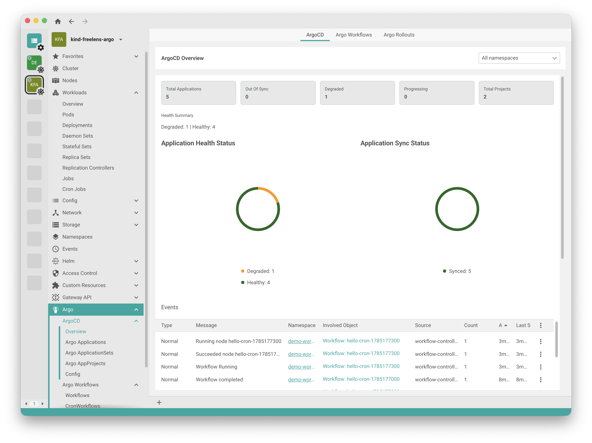
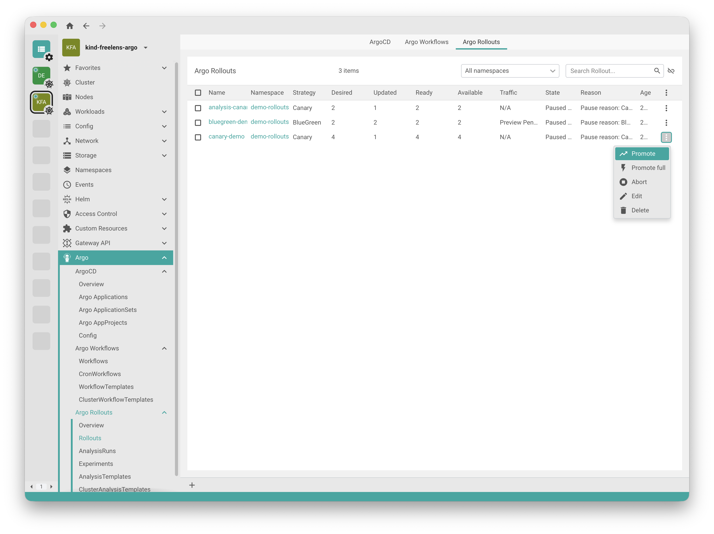

# Freelens Argo Extension

[](https://www.freelens.app)
[](https://www.npmjs.com/package/@sebastian-prokesch/freelens-argo-extension)
[](https://opensource.org/licenses/MIT)
[](https://github.com/Sebastian-Prokesch/freelens-argocd-extension/actions/workflows/ci.yml)

Bring your Argo workloads into [Freelens](https://www.freelens.app). This extension adds a dedicated **Argo** section to the cluster sidebar with pages, detail views, and actions for **ArgoCD** and **Argo Rollouts**, plus early support for **Argo Workflows** — so you can monitor application health, sync state, and rollout progress without leaving your Kubernetes IDE.

## Screenshots

### ArgoCD Overview

Application health and sync status at a glance, alongside recent cluster events:

<picture>
  <source media="(prefers-color-scheme: dark)" srcset="docs/screenshots/ArgoCD-Overview.png">
  <source media="(prefers-color-scheme: light)" srcset="docs/screenshots/ArgoCD-Overview-light.png">
  
</picture>

### Rollout actions

Manage rollouts directly from the list — promote, abort, or edit paused canary and blue-green deployments:

<picture>
  <source media="(prefers-color-scheme: dark)" srcset="docs/screenshots/ArgoRollouts-Promote.png">
  <source media="(prefers-color-scheme: light)" srcset="docs/screenshots/ArgoRollouts-Promote-light.png">
  
</picture>

## Features

- Argo sidebar hub with grouped sections for ArgoCD, Argo Workflows, and Argo Rollouts.
- ArgoCD overview and list pages for `Application`, `ApplicationSet`, and `AppProject`, plus a Config page for Argo ConfigMaps and Secrets.
- Argo Rollouts pages for `Rollout`, `AnalysisRun`, `Experiment`, `AnalysisTemplate`, and `ClusterAnalysisTemplate`.
- Argo Workflows pages for `Workflow`, `CronWorkflow`, `WorkflowTemplate`, and `ClusterWorkflowTemplate`.
- Resource detail drawers with diagnostics such as sync/health status, operation timeline, and resource diff.
- Context-menu actions:
  - ArgoCD: refresh, hard refresh, sync, and terminate.
  - Rollouts: promote, promote full, promote skip current, promote skip all, abort, retry.
  - Argo config helpers for `Secret` and `ConfigMap`.

All resources are served from the `argoproj.io/v1alpha1` API group.

## Status

ArgoCD and Argo Rollouts pages and actions are stable for day-to-day use. Argo Workflows pages are present but still early and may evolve quickly. Feature behavior depends on your cluster RBAC and installed resource schemas — see the [CHANGELOG](CHANGELOG.md) for release history.

## Requirements

- Freelens `^1.9.0`
- Kubernetes >= 1.32
- The cluster must have the Argo APIs you want to manage installed (Argo CD for Applications; Rollouts and Workflows only if those controllers are present).

## Install

### From npm

1. Open Freelens and go to **Extensions** (`Ctrl`+`Shift`+`E` or `Cmd`+`Shift`+`E`).
2. Enter the package name in the install field: `@sebastian-prokesch/freelens-argo-extension`

See the package on [npm](https://www.npmjs.com/package/@sebastian-prokesch/freelens-argo-extension).

### From GitHub release

1. Download the latest `.tgz` from the [GitHub Releases](https://github.com/Sebastian-Prokesch/freelens-argocd-extension/releases) page.
2. Open Freelens → **Extensions** (`Ctrl`+`Shift`+`E` or `Cmd`+`Shift`+`E`).
3. Load the tarball path, or drag and drop the `.tgz` into the Freelens window.

## Security and permissions

- Mutating actions (sync, promote, config edits) run with your current cluster identity and are limited by Kubernetes RBAC — prefer read-only permissions where mutation is not required.
- Secret updates are submitted through Kubernetes `stringData`; grant edit access only to trusted operators.

## Build from source

Requires Node.js >= 24 and pnpm 11.x (Corepack recommended).

```sh
corepack install
pnpm i
pnpm build
pnpm pack
```

The tarball is generated in the project root. In Freelens, open Extensions and provide the tarball path, or drag and drop the `.tgz` into the Freelens window.

For checks, tests, and PR expectations see [CONTRIBUTING.md](CONTRIBUTING.md). A local Kind-based demo cluster with Argo CD, Rollouts, and Workflows preinstalled is available under [dev-cluster](dev-cluster/README.md).

## Contributing

Contributions are welcome.

- **Bug reports and ideas** — open an [issue](https://github.com/Sebastian-Prokesch/freelens-argocd-extension/issues) with steps to reproduce, expected behavior, and your Freelens/Kubernetes setup when relevant.
- **Code changes** — open a [pull request](https://github.com/Sebastian-Prokesch/freelens-argocd-extension/pulls) against `main` with a short description of what changed and why. For larger changes, open an issue first so we can align on approach.

See [CONTRIBUTING.md](CONTRIBUTING.md) for local setup and verification steps, and the [CHANGELOG](CHANGELOG.md) for release history.

## AI assistance

Parts of this extension were developed with help from an AI coding assistant. All changes are reviewed and maintained by the project authors.

## License

Copyright (c) 2026 Freelens Authors & Sebastian Prokesch.

[MIT License](https://opensource.org/licenses/MIT)
